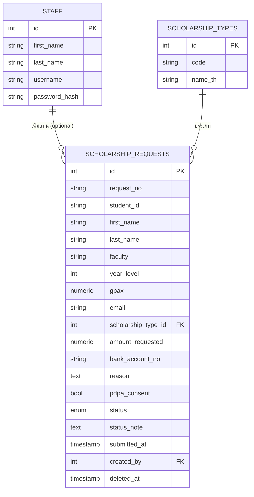

# PROJECT-PLAN.md
## ระบบบริหารจัดการคำขอทุนการศึกษา (Scholarship Request Management)

เอกสารนี้จัดทำขึ้นตามข้อสอบภาคปฏิบัติ (POC) การสอบคัดเลือกพนักงานเงินรายได้
ตำแหน่งนักวิชาการคอมพิวเตอร์ กองพัฒนานักศึกษาและศิษย์เก่าสัมพันธ์ มหาวิทยาลัยสงขลานครินทร์
และตามความต้องการที่ระบุใน `JOB.md` เพื่อใช้เป็นแผนแม่บทก่อนเริ่มพัฒนาระบบจริง

---

## 1. ภาพรวมโปรเจกต์

ระบบเว็บแอปพลิเคชันสำหรับบริหารจัดการคำขอทุนการศึกษา แบ่งการใช้งานเป็น 2 ส่วน

| ส่วน | ผู้ใช้ | การเข้าถึง |
|---|---|---|
| หน้ายื่นคำขอทุน (Public) | นักศึกษา | ไม่ต้องเข้าสู่ระบบ |
| หน้าจัดการคำขอทุน (Admin) | เจ้าหน้าที่ทุน (staff) | ต้อง Login |

**Tech Stack (ตาม JOB.md ซึ่งอยู่ในรายการที่โจทย์สนับสนุน)**

- Frontend: ReactJS + Bootstrap 5
- Backend: Node.js + Express (RESTful API)
- Database: PostgreSQL
- โครงสร้าง: รวม Frontend + Backend ไว้ใน Repository เดียว (monorepo แบบ 2 โฟลเดอร์) เพื่อง่ายต่อการพัฒนา รัน และ deploy

---

## 2. โครงสร้างโปรเจกต์ (Folder Structure)

โปรเจกต์ปัจจุบันยังว่างเปล่า (มีแค่ README.md) จึงเสนอโครงสร้างเริ่มต้นดังนี้

```
Scholarship-Request-Management-React/
├── client/                     # React (Bootstrap UI)
│   ├── src/
│   │   ├── pages/
│   │   │   ├── public/         # หน้ายื่นคำขอทุน (ไม่ต้อง login)
│   │   │   └── admin/          # หน้าจัดการ (ต้อง login)
│   │   ├── components/
│   │   ├── layouts/
│   │   ├── services/           # เรียก REST API (axios)
│   │   ├── context/             # AuthContext
│   │   └── App.jsx
│   ├── Dockerfile
│   └── package.json
├── server/                     # Node.js + Express API
│   ├── src/
│   │   ├── config/              # db.js, env.js
│   │   ├── controllers/
│   │   ├── routes/
│   │   ├── middlewares/         # auth (JWT), validate, errorHandler
│   │   ├── models/               # query layer (pg)
│   │   ├── db/
│   │   │   ├── migrations/
│   │   │   └── seeds/
│   │   └── app.js
│   ├── Dockerfile
│   └── package.json
├── docs/
│   ├── ER-Diagram.md / .png
│   └── System-Architecture.md
├── docker-compose.yml
├── .env.example
├── README.md
└── PROJECT-PLAN.md
```

Naming convention: DB = `snake_case`, JS/React = `camelCase` ตัวแปร / `PascalCase` component,
REST route = `kebab-case` เลขพหูพจน์ (เช่น `/api/scholarship-requests`)

---

## 3. การออกแบบฐานข้อมูล (PostgreSQL)

ฐานข้อมูลเป้าหมาย: **`srm_db`** (ตามที่เตรียมไว้แล้วบน Aiven — ไม่ใช่ `defaultdb`)

### ตาราง `staff` (ตาม JOB.md)

| คอลัมน์ | ชนิดข้อมูล | หมายเหตุ |
|---|---|---|
| id | SERIAL PK | |
| first_name | VARCHAR(100) | |
| last_name | VARCHAR(100) | |
| username | VARCHAR(50) UNIQUE NOT NULL | |
| password_hash | VARCHAR(255) NOT NULL | bcrypt hash |
| created_at | TIMESTAMPTZ DEFAULT now() | |
| updated_at | TIMESTAMPTZ DEFAULT now() | |

### ตาราง `scholarship_types` (lookup, รองรับเพิ่มประเภทในอนาคต)

| คอลัมน์ | ชนิดข้อมูล |
|---|---|
| id | SERIAL PK |
| code | VARCHAR(50) UNIQUE |
| name_th | VARCHAR(150) |

Seed ค่าเริ่มต้น 5 ประเภทตามโจทย์ข้อ 3.3: ทุนขาดแคลนทุนทรัพย์, ทุนส่งเสริมการศึกษา (เรียนดี),
ทุนทำงานพิเศษ (นักศึกษาช่วยงาน), ทุนฉุกเฉิน/ช่วยเหลือกรณีพิเศษ, ทุนกิจกรรมนักศึกษา

### ตาราง `scholarship_requests`

| คอลัมน์ | ชนิดข้อมูล | หมายเหตุ |
|---|---|---|
| id | SERIAL PK | |
| request_no | VARCHAR(30) UNIQUE | เลขที่คำขอ เช่น SRQ-2026-000001 |
| student_id | VARCHAR(20) NOT NULL | รหัสนักศึกษา |
| first_name | VARCHAR(100) NOT NULL | |
| last_name | VARCHAR(100) NOT NULL | |
| faculty | VARCHAR(150) NOT NULL | คณะ/สาขา |
| year_level | SMALLINT NOT NULL | ชั้นปี |
| gpax | NUMERIC(3,2) NOT NULL | เกรดเฉลี่ย |
| email | VARCHAR(150) NOT NULL | ตรวจสอบรูปแบบอีเมล |
| scholarship_type_id | INT FK → scholarship_types | |
| amount_requested | NUMERIC(12,2) NOT NULL CHECK (> 0) | |
| bank_account_no | VARCHAR(30) NOT NULL | แสดงแบบ mask บางส่วนใน UI (bonus) |
| reason | TEXT NOT NULL | เหตุผลการขอทุน |
| pdpa_consent | BOOLEAN NOT NULL DEFAULT false | ต้อง true ก่อนบันทึก |
| status | request_status ENUM | 'pending' \| 'approved' \| 'rejected' ค่าเริ่มต้น 'pending' |
| status_note | TEXT NULL | หมายเหตุตอนอนุมัติ/ไม่อนุมัติ |
| submitted_at | TIMESTAMPTZ DEFAULT now() | |
| created_by | INT NULL FK → staff.id | NULL = นักศึกษายื่นเอง, ไม่ NULL = เจ้าหน้าที่เพิ่มแทน |
| updated_at | TIMESTAMPTZ DEFAULT now() | |
| deleted_at | TIMESTAMPTZ NULL | Soft delete — ไม่ NULL = ถูกลบแล้ว |

Index แนะนำ: `status`, `scholarship_type_id`, `student_id`, `deleted_at`, และ partial index
`WHERE deleted_at IS NULL` สำหรับ query รายการปกติ

### ER Diagram (สรุป)



---

## 4. การออกแบบ REST API

**Public (ไม่ต้อง auth)**
- `GET  /api/public/scholarship-types` — รายการประเภททุนสำหรับ dropdown
- `POST /api/public/scholarship-requests` — ยื่นคำขอทุน (validate + ต้อง pdpa_consent = true)

**Auth**
- `POST /api/auth/login` — คืน JWT (httpOnly cookie)
- `POST /api/auth/logout`
- `GET  /api/auth/me` — ตรวจสอบ session ปัจจุบัน

**Staff (ต้อง JWT, protected middleware)**
- `GET    /api/scholarship-requests` — list พร้อม `page`, `pageSize=10`, `search`, `status`, `type`
- `GET    /api/scholarship-requests/:id`
- `POST   /api/scholarship-requests` — เจ้าหน้าที่เพิ่มคำขอแทนนักศึกษา
- `PUT    /api/scholarship-requests/:id` — แก้ไข
- `PATCH  /api/scholarship-requests/:id/status` — เปลี่ยนสถานะ (approved/rejected) + note
- `DELETE /api/scholarship-requests/:id` — soft delete (อนุญาตเฉพาะ status = pending)
- `GET    /api/dashboard/summary` — จำนวนรวม, จำนวนแยกสถานะ, จำนวน/ยอดเงินแยกประเภททุน

---

## 5. Frontend Routes

**Public**
- `/` → redirect หรือหน้าแรกแนะนำระบบ
- `/request` → ฟอร์มยื่นคำขอทุน + PDPA consent
- `/request/success` → แจ้งผลการส่งคำขอ

**Staff**
- `/login`
- `/admin` (protected layout, redirect ไป `/login` ถ้าไม่ได้ login)
  - `/admin/dashboard` — กราฟ + ตัวเลขสรุป (Chart.js ผ่าน react-chartjs-2)
  - `/admin/requests` — ตาราง + pagination (10/หน้า) + ค้นหา/กรอง
  - `/admin/requests/new` — เพิ่มคำขอ
  - `/admin/requests/:id/edit` — แก้ไข/เปลี่ยนสถานะ/ลบ (soft delete + modal ยืนยัน)

---

## 6. Authentication & Security

- Password: bcrypt hash (ห้ามเก็บ plain text) — ตรงกับเกณฑ์พิเศษข้อ "การจัดเก็บรหัสผ่านอย่างปลอดภัย"
- Login: ออก JWT เก็บใน httpOnly cookie, middleware ตรวจสอบทุก route ใน `/api/scholarship-requests`, `/api/dashboard/*`
- Validation ทั้ง client-side (ฟอร์ม) และ server-side (Express middleware, เช่น `express-validator`)
  ให้ตรงกันทุกฟิลด์ (โจทย์ระบุว่าฟอร์ม staff ต้อง validate แบบเดียวกับฟอร์มนักศึกษา)
- Data Masking (bonus): แสดงเลขบัญชีธนาคารแบบ mask บางหลักในตาราง/รายการ เช่น `XXX-X-X1234-X`
- CORS จำกัด origin เฉพาะ client, ใช้ Helmet ตั้งค่า security headers พื้นฐาน

---

## 7. Seed Data

- Staff ทดสอบอย่างน้อย 1 บัญชี (username/password จะระบุไว้ใน README ตามที่โจทย์กำหนด)
- คำขอทุนตัวอย่างอย่างน้อย **25 รายการ** กระจายครบทั้ง 5 ประเภททุน และ 3 สถานะ (pending/approved/rejected)
- จัดทำเป็น seed script (`server/src/db/seeds/`) รันซ้ำได้ (idempotent) แยกจาก migration

---

## 8. Docker & Environment

`docker-compose.yml` ต้องรันได้ด้วยคำสั่งเดียว (`docker compose up`) ประกอบด้วย 3 services:

1. `db` — PostgreSQL container อิสระ (ใช้สำหรับกรรมการรันทดสอบ **ไม่ใช่** DB บน Aiven)
2. `server` — Express API
3. `client` — React (build แล้ว serve ผ่าน nginx หรือ dev server)

`.env.example` จะระบุ key ที่ต้องใช้ (ไม่ใส่ค่าจริง) เช่น `DATABASE_URL`, `JWT_SECRET`, `PORT`,
`CLIENT_URL` เป็นต้น

> **ข้อควรระวังด้านความปลอดภัย:** โจทย์กำหนดให้ตั้ง Git Repository เป็น **Public** ดังนั้น
> ห้าม commit connection string / password จริงของฐานข้อมูล Aiven ที่ให้ไว้ใน `JOB.md`
> ลงใน repository เด็ดขาด (รวมถึงใน `.env`, README ตัวอย่าง หรือไฟล์ใด ๆ ที่จะถูก push)
> ให้ใช้ Aiven DB สำหรับพัฒนา/ทดสอบส่วนตัวเท่านั้น ส่วน docker-compose ที่ส่งมอบให้กรรมการ
> ต้องใช้ Postgres container ของตัวเอง

---

## 9. แผนการดำเนินงาน (Phase)

| Phase | งาน | เกณฑ์คะแนนที่ตอบโจทย์ |
|---|---|---|
| 0 | Scaffold repo (client/server), ตั้งค่า Docker skeleton, เชื่อมต่อ DB | ข้อ 8, 9 |
| 1 | Migration + Seed (staff, scholarship_types, scholarship_requests) | ข้อ 8 |
| 2 | Backend API: auth, public submit, CRUD, status, dashboard summary | ข้อ 1,2,3,4,5,6 |
| 3 | Frontend: หน้ายื่นคำขอ (public) + PDPA | ข้อ 2, 7 |
| 4 | Frontend: Login, list+pagination+search/filter+status | ข้อ 1, 5, 7 |
| 5 | Frontend: Add/Edit + Delete (soft delete + confirm modal) | ข้อ 3, 4, 7 |
| 6 | Frontend: Dashboard + กราฟ | ข้อ 6, 7 |
| 7 | Docker compose เต็มระบบ + README + .env.example | ข้อ 9 |
| 8 | QA เทียบเกณฑ์ให้คะแนนทั้ง 9 ข้อ + เตรียมวิดีโอสาธิต + Tag/Release | ทั้งหมด |
| 9 (bonus, ทำหลังข้อ 3 ครบถ้วนเท่านั้น) | เลือก 1 ฟีเจอร์เสริม + data masking + ER diagram doc + เอกสาร AI tools | คะแนนพิเศษ |

---

## 10. Checklist ก่อนส่งงาน (อิงเกณฑ์ให้คะแนน 100 คะแนน)

- [ ] รายการคำขอทุน ตาราง + แบ่งหน้า 10/หน้า (10 คะแนน)
- [ ] ฟอร์มยื่นคำขอ public + validation + PDPA consent (10 คะแนน)
- [ ] เพิ่ม/แก้ไขคำขอทุนโดยเจ้าหน้าที่ (15 คะแนน)
- [ ] ลบแบบ Soft Delete + ยืนยันก่อนลบ + จำกัดเฉพาะสถานะรอพิจารณา (5 คะแนน)
- [ ] Login/Logout, ค้นหา/กรอง, จัดการสถานะ อนุมัติ/ไม่อนุมัติ (10 คะแนน)
- [ ] Dashboard พร้อมกราฟอย่างน้อย 1 รูปแบบ (10 คะแนน)
- [ ] UX/UI ใช้งานง่าย สวยงาม (15 คะแนน)
- [ ] ออกแบบ/เชื่อมต่อ PostgreSQL ถูกต้อง (15 คะแนน)
- [ ] Docker + docker-compose รันครบด้วยคำสั่งเดียว + README ชัดเจน (10 คะแนน)
- [ ] README มี: เทคโนโลยี, วิธีติดตั้ง/รัน, บัญชีทดสอบ, วิธี seed data
- [ ] Tag/Release ก่อนส่ง + ระบุ commit hash สุดท้ายในอีเมล
- [ ] วิดีโอสาธิตยาว 5–10 นาที ครบทุกฟังก์ชันเรียงตามเกณฑ์

---

## 11. ประเด็นที่ต้องยืนยันกับผู้ใช้

1. วันที่เริ่มนับ 7 วัน (เพื่อวางกำหนดการรายวันให้ชัดเจนกว่านี้)
2. ต้องการทำฟีเจอร์เสริม (ข้อ 9 ในตาราง Phase) หรือไม่ และเลือกแบบไหน (Report/Export หรือระบบคัดกรองอัตโนมัติ)
3. ต้องการ deploy ให้ทดลองใช้ออนไลน์ด้วยหรือไม่ (bonus)
4. ยืนยันใช้ Chart.js (react-chartjs-2) สำหรับ Dashboard หรือมีไลบรารีอื่นที่ถนัดกว่า

---

**สถานะเอกสาร:** ฉบับร่างสำหรับตรวจทาน — ยังไม่เริ่มพัฒนาโค้ดจนกว่าจะได้รับการยืนยันแผนนี้จากผู้ใช้
