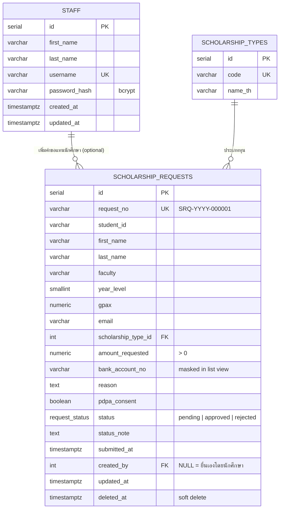

# ER Diagram

## หมายเหตุ

- `scholarship_requests.deleted_at IS NOT NULL` หมายถึงรายการถูกลบแบบ Soft Delete
  และจะถูกกรองออกจากทุก query ของรายการปกติ (`WHERE deleted_at IS NULL`)
- `status` เป็น PostgreSQL ENUM (`request_status`) จำกัดค่าได้เฉพาะ `pending`, `approved`, `rejected`
- Index ที่สร้างไว้: `status`, `scholarship_type_id`, `student_id`, `deleted_at`
  เพื่อรองรับการค้นหา/กรอง/แบ่งหน้าอย่างมีประสิทธิภาพ
- ที่มา schema แบบเต็ม: [`server/src/db/migrations/001_init.sql`](../server/src/db/migrations/001_init.sql)
