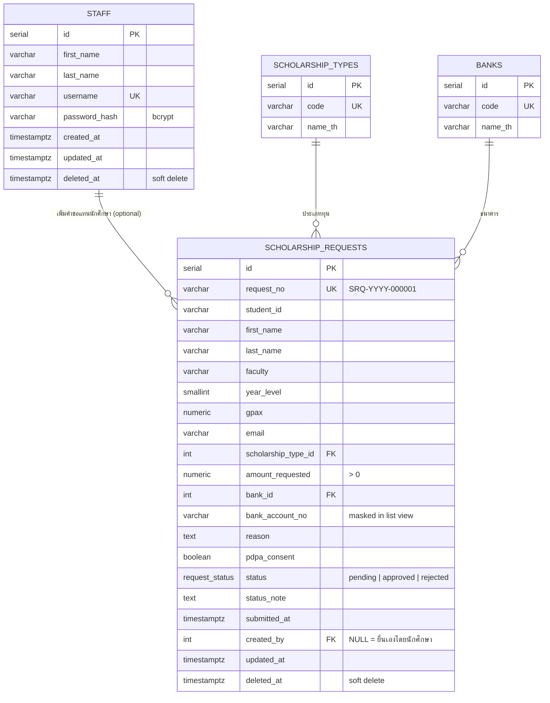

# ER Diagram

## หมายเหตุ

- `deleted_at IS NOT NULL` (ทั้งใน `scholarship_requests` และ `staff`) หมายถึงรายการถูกลบแบบ
  Soft Delete และจะถูกกรองออกจากทุก query ของรายการปกติ (`WHERE deleted_at IS NULL`)
- `status` เป็น PostgreSQL ENUM (`request_status`) จำกัดค่าได้เฉพาะ `pending`, `approved`, `rejected`
- Index ที่สร้างไว้: `scholarship_requests(status)`, `scholarship_requests(scholarship_type_id)`,
  `scholarship_requests(bank_id)`, `scholarship_requests(student_id)`,
  `scholarship_requests(deleted_at)`, `staff(deleted_at)` เพื่อรองรับการค้นหา/กรอง/แบ่งหน้า
  อย่างมีประสิทธิภาพ
- `banks` และ `scholarship_types` เป็นตาราง lookup ที่ seed ไว้ล่วงหน้า (20 ธนาคาร และ 5 ประเภททุน
  ตามลำดับ) ไม่มีหน้าจัดการ CRUD ให้เจ้าหน้าที่แก้ไขเอง
- ที่มา schema: [`server/src/db/migrations/`](../server/src/db/migrations) — ไฟล์ SQL เรียงลำดับ
  ตามเลข รันแบบ idempotent ได้ทั้งหมด (`001_init.sql` สร้างโครงสร้างเริ่มต้น, ไฟล์ถัดไปเป็นการ
  ปรับปรุงภายหลัง เช่น soft delete ของ `staff` และตาราง `banks`)
