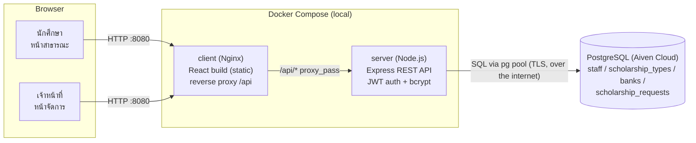

# System Architecture

## ภาพรวม

ฐานข้อมูลไม่ได้รันเป็น container ในเครื่อง แต่เป็น PostgreSQL บน [Aiven Cloud](https://aiven.io)
ตัวเดียวกันทั้งตอนพัฒนา (local Docker Compose), ตอน deploy จริงบน Render และใช้ค่าเชื่อมต่อเดียวกัน
ผ่าน environment variable `DATABASE_URL` — จึงต้องมีการเชื่อมต่ออินเทอร์เน็ตขณะรันเสมอ

## เส้นทางการทำงานหลัก (API Routes)

| กลุ่ม | Endpoint | Auth | หน้าที่ |
|---|---|---|---|
| Public | `GET /api/public/scholarship-types` | ไม่ต้อง | รายชื่อประเภททุน (lookup) |
| Public | `GET /api/public/banks` | ไม่ต้อง | รายชื่อธนาคาร (lookup) |
| Public | `POST /api/public/scholarship-requests` | ไม่ต้อง | นักศึกษายื่นคำขอทุน บังคับ `pdpa_consent = true` |
| Auth | `POST /api/auth/login`, `POST /api/auth/logout`, `GET /api/auth/me` | login ไม่ต้อง auth, `me` ต้อง auth | เข้าสู่ระบบเจ้าหน้าที่ ออก/ตรวจสอบ JWT |
| คำขอทุน | `GET/POST /api/scholarship-requests`, `GET/PUT /:id`, `PATCH /:id/status`, `DELETE /:id` | ต้อง auth | CRUD คำขอทุน + เปลี่ยนสถานะ + ลบแบบ soft delete |
| แดชบอร์ด | `GET /api/dashboard/summary` | ต้อง auth | สรุปยอดคำขอ/สถานะ/ประเภททุนสำหรับหน้าแดชบอร์ด |
| รายงาน | `GET /api/reports/summary`, `GET /api/reports/details`, `GET /api/reports/export` | ต้อง auth | รายงานแบบกรองตามช่วงวันที่/สถานะ/ประเภททุน และ export Excel |
| เจ้าหน้าที่ | `GET/POST /api/staff`, `GET/PUT /:id`, `DELETE /:id` | ต้อง auth | CRUD บัญชีเจ้าหน้าที่ + ลบแบบ soft delete |

เส้นทางที่ "ต้อง auth" ทั้งหมดผ่าน middleware `requireAuth` ที่ตรวจสอบ JWT จาก httpOnly cookie
(`token`) ทุกคำขอ — ระบบไม่มีแนวคิดสิทธิ์ตามบทบาท (role-based) แยกย่อย เจ้าหน้าที่ทุกบัญชีมีสิทธิ์
เท่ากันทั้งหมด

ตัวอย่าง flow ที่ใช้บ่อย:

1. **นักศึกษายื่นคำขอ** — โหลดตัวเลือกประเภททุนและธนาคารจาก endpoint public สองตัวแรก กรอกฟอร์ม
   แล้ว `POST /api/public/scholarship-requests` ตรวจสอบข้อมูลด้วย `express-validator` ทั้งฝั่ง
   client และ server (กติกาเดียวกับฟอร์มของเจ้าหน้าที่) ก่อนบันทึกในสถานะ `pending`
2. **เจ้าหน้าที่เข้าสู่ระบบ** — ตรวจสอบรหัสผ่านด้วย bcrypt แล้วออก JWT อายุ 8 ชั่วโมง
3. **รายการ/ค้นหา/กรอง** — `GET /api/scholarship-requests` รองรับ `page`, `search`, `status`, `type`
   คืนค่าพร้อม pagination (10 รายการ/หน้า) และปิดบังเลขบัญชีธนาคาร (data masking)
4. **แก้ไข/เปลี่ยนสถานะ/ลบ** — `PUT`, `PATCH .../status`, `DELETE` ตามลำดับ โดย `DELETE`
   เป็น soft delete และอนุญาตเฉพาะคำขอสถานะ `pending`
5. **รายงาน/Export** — `GET /api/reports/export` สร้างไฟล์ `.xlsx` ด้วย ExcelJS ฝั่ง server
   ตามเงื่อนไขตัวกรองเดียวกับที่ใช้แสดงผลบนหน้าเว็บ แล้ว stream กลับเป็นไฟล์ดาวน์โหลด

## การ Deploy

โปรเจกต์นี้มี Docker setup 2 แบบสำหรับ 2 สถานการณ์ โดยทั้งคู่เชื่อมต่อฐานข้อมูล Aiven Cloud
ตัวเดียวกัน (ไม่มีการรัน PostgreSQL เป็น container เอง):

- **`docker-compose.yml`** (สำหรับรัน/ทดสอบในเครื่อง) — แยก 2 services:
  - `client`: build ด้วย Vite แล้ว serve เป็นไฟล์ static ผ่าน Nginx พร้อม reverse proxy เส้นทาง
    `/api/` ไปยัง service `server` ภายใน Docker network เดียวกัน ทำให้ browser เห็นเป็น
    same-origin (ไม่ต้องพึ่งพา CORS ระหว่างใช้งานจริง)
  - `server`: Express API เชื่อมต่อฐานข้อมูลผ่าน environment variable `DATABASE_URL`
- **`Dockerfile`** (root, สำหรับ deploy บน Render) — build image เดียวรวม client (React build
  แบบ static) เข้ากับ server แล้ว serve ผ่าน Express process เดียวกัน (ดู logic ใน `server/src/app.js`
  ที่ serve `express.static` จากโฟลเดอร์ `public` เมื่อมีไฟล์ build อยู่)

โครงสร้างฐานข้อมูล (ตาราง, index, constraint) และข้อมูลตัวอย่างไม่ได้ถูกสร้างอัตโนมัติตอน container
เริ่มทำงาน แต่รันแยกด้วยคำสั่ง `npm run db:migrate` และ `npm run db:seed` ภายในโฟลเดอร์ `server/`
(ดูรายละเอียดใน [`server/src/db/migrations/`](../server/src/db/migrations) และ
[`server/src/db/seeds/`](../server/src/db/seeds)) — เขียนแบบ idempotent จึงรันซ้ำได้อย่างปลอดภัย
