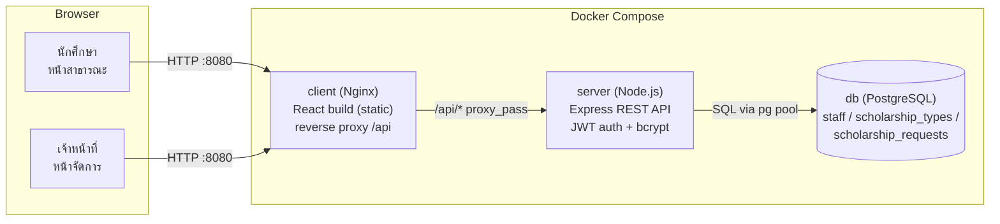

# System Architecture

## ภาพรวม

## เส้นทางการทำงานหลัก

1. **นักศึกษายื่นคำขอ** — `POST /api/public/scholarship-requests` (ไม่ต้อง auth)
   ตรวจสอบข้อมูลด้วย `express-validator` ทั้งฝั่ง client และ server รวมถึงบังคับ `pdpa_consent = true`
   ก่อนบันทึกลงฐานข้อมูลในสถานะ `pending`
2. **เจ้าหน้าที่เข้าสู่ระบบ** — `POST /api/auth/login` ตรวจสอบรหัสผ่านด้วย bcrypt แล้วออก JWT
   เก็บใน httpOnly cookie (`token`) อายุ 8 ชั่วโมง
3. **เส้นทางที่ต้อง auth** (`/api/scholarship-requests/*`, `/api/dashboard/*`) ผ่าน middleware
   `requireAuth` ที่ตรวจสอบ JWT จาก cookie ทุกคำขอ
4. **รายการ/ค้นหา/กรอง** — `GET /api/scholarship-requests` รองรับ `page`, `search`, `status`, `type`
   คืนค่าพร้อม pagination (10 รายการ/หน้า) และปิดบังเลขบัญชีธนาคาร (data masking)
5. **แก้ไข/เปลี่ยนสถานะ/ลบ** — `PUT`, `PATCH .../status`, `DELETE` ตามลำดับ
   โดย `DELETE` เป็น soft delete และอนุญาตเฉพาะคำขอสถานะ `pending`

## การ Deploy ด้วย Docker

- `client` build ด้วย Vite แล้ว serve เป็นไฟล์ static ผ่าน Nginx, ตั้งค่า reverse proxy เส้นทาง
  `/api/` ไปยัง service `server` ภายใน Docker network เดียวกัน ทำให้ browser เห็นเป็น same-origin
  (ไม่ต้องพึ่งพา CORS ระหว่างใช้งานจริง)
- `server` เป็น Express API แยกอิสระ เชื่อมต่อฐานข้อมูลผ่าน environment variable `DATABASE_URL`
- `db` เป็น PostgreSQL container อิสระสำหรับการทดสอบ ที่สร้างตารางและนำเข้าข้อมูลตัวอย่างอัตโนมัติ
  ผ่าน `docker-entrypoint-initdb.d` ในการรันครั้งแรก (แยกจากฐานข้อมูลที่ใช้พัฒนาระบบจริง)
